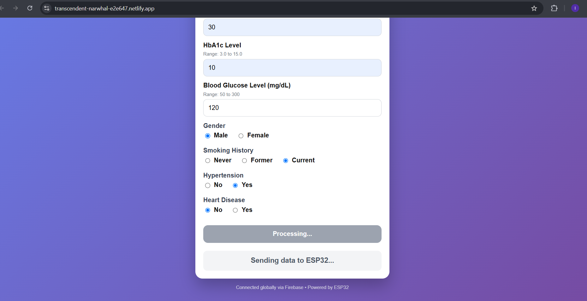
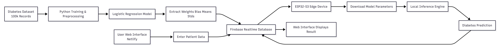
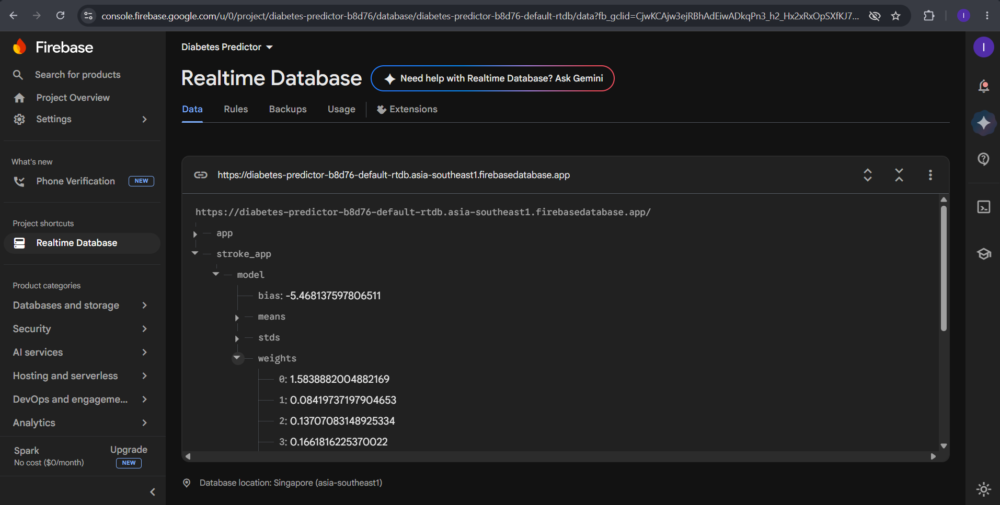
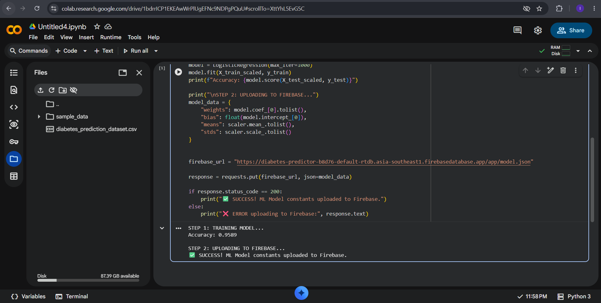

# ESP32 Diabetes Predictor

Cloud-connected diabetes prediction system using Machine Learning, Firebase, ESP32-S3 and Netlify.
## Features

- Diabetes risk prediction using Machine Learning
- ESP32-S3 edge deployment
- Firebase cloud integration
- Netlify web interface
- Real-time prediction system

## Technologies Used

- Python
- Scikit-Learn
- ESP32-S3
- Firebase Realtime Database
- HTML/CSS/JavaScript
- Netlify

## System Architecture

## Project Screenshots

### Web Interface

### ESP32 Hardware

### Firebase Integration

### Model Training

